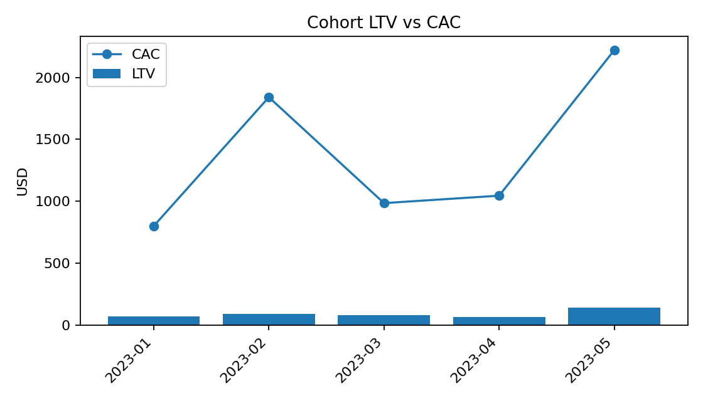

# GTM Cohort CAC LTV

Cohort model for go-to-market analytics. It builds monthly acquisition cohorts, computes cumulative **LTV**, **CAC**, and **LTV:CAC**, and exports a stakeholder-ready Excel workbook plus a preview chart.

---

## Quickstart (one command)

```bash
# 1) Create and activate a virtual environment
python3 -m venv .venv && source .venv/bin/activate

# 2) Install dependencies
pip install -r requirements.txt
# (or) pip install duckdb pandas numpy matplotlib xlsxwriter openpyxl

# 3) Generate Excel + PNG from the sample CSVs
python -m src.cohort_cli --orders data/orders_sample.csv --spend data/marketing_spend.csv --out reports/cac_ltv_cohorts.xlsx

```

## Artifacts created:

- [Download the Excel workbook](reports/cac_ltv_cohorts.xlsx)
- Preview chart:



---

## What this repo is for

Turn raw transactions and marketing spend into a decision-ready view of unit economics. This is the kind of concise, reproducible analysis teams use in Strategy & Operations, GTM Ops, Growth, and Product Analytics to answer:

- Are new cohorts paying back faster or slower than prior cohorts?
- How does LTV compare to CAC by cohort month?
- Where should we shift budget or revisit pricing/retention?

---

## Inputs and sample data (included)

Small, self-contained CSVs so anyone can run the project:

- data/orders_sample.csv
Columns: order_id, order_date, customer_id, channel, revenue
Context: synthetic e-commerce orders across a few channels. The first order defines the customer’s cohort month.

- data/marketing_spend.csv
Columns: month (YYYY-MM), channel, spend
Context: monthly media spend. For a robust demo, CAC is computed as total spend in cohort month / new customers that month.
(Later you can refine to per-channel attribution.)

PS: These samples are intentionally small for fast, transparent runs

--- 

## Methods (concise)

- Build a lightweight DuckDB data mart from the two CSVs (SQL is executed from Python).
- Derive each customer’s first_order_date → cohort month.
- Aggregate revenue by cohort_month × months_since_cohort.
- Compute LTV as cumulative revenue per new customer over time.
- Compute CAC as total spend in the cohort month divided by new customers that month.
- Produce a Summary with LTV_latest, CAC, and LTV:CAC per cohort.

---

## How to read the outputs

# Excel workbook (reports/cac_ltv_cohorts.xlsx)
- LTV_cumulative: rows are cohort months, columns are months since cohort. Values are cumulative LTV. Read across a row to see payback progress.
- Summary: per cohort month — latest cumulative LTV, CAC, and the LTV:CAC ratio.

# PNG chart (ltv_vs_cac.png)

- Bars = LTV (latest) by cohort.
- Line = CAC by cohort.
- Quick visual to spot cohorts that don’t reach payback or have declining quality.

# Rules of thumb

- LTV:CAC > 1 is a baseline; many teams target higher multiples depending on margin and payback policy.
- Watch time-to-breakeven by cohort. Faster breakeven implies healthier acquisition or stronger retention/ARPU.

---

## Practical applications (for GTM & Strategy roles)

- Budget planning: compare cohorts to decide where to scale, pause, or rebalance spend.
- GTM performance: track how acquisition quality shifts with seasonality or channel mix.
- Product & pricing: changes that improve retention/ARPU lift the LTV curve; the model makes that visible.
- Executive reporting: drop the Summary sheet and PNG into a deck with a short narrative.

---

## Repository structure

```bash
data/            # CSV inputs (orders, marketing spend)
assets/          # preview image for README
reports/         # Excel output (stakeholder workbook)
notebooks/       # optional exploratory notebook(s)
src/             # one-command CLI to regenerate artifacts
  └── cohort_cli.py
requirements.txt
README.md

```

---

## Parameters

```bash
python -m src.cohort_cli \
  --orders data/orders_sample.csv \
  --spend  data/marketing_spend.csv \
  --out    reports/cac_ltv_cohorts.xlsx
```

- orders path to orders CSV (order_id, order_date, customer_id, channel, revenue)
- spend path to spend CSV (month YYYY-MM, channel, spend)
- out Excel path to write (created or overwritten)

---

## Troubleshooting

- Excel is open: close the workbook before rerunning (file lock).
- Header mismatch: align column names and date formats to the samples.
- Attribution depth: current CAC uses total spend per cohort month; extend with per-channel attribution if you want finer granularity.
- Margin vs revenue: add a cost column to compute contribution LTV and explicit payback periods.


